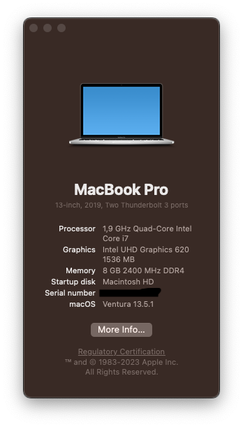

# Hackintosh for Dell Latitude 5400

*Based on OpenCore*

**WARNING: This repository uses macOS 13 Ventura, if you need info for Montenery or Big Sur, please check out @msbence 's repository here: https://github.com/msbence/hackintosh-DellLatitude5400/tree/master.**

## Specification

| | |
|-|-|
|**CPU**|Intel i5-8365U CPU @ 1.60GHz (Whiskey Lake)|
|**RAM**|8GB DDR4 2400MHz|
|**IGPU**|Intel UHD 620|
|**SSD**|Crucial P1 1TB NVMe|
|**ETH**|Intel I217-LM|
|**WLAN+BT**|Intel 9560NGW|
|**WWAN**|Not present|
|**Audio**|Realtek ALC236|
|**Ports**|USB-C (PD+DP-AltMode), 3xUSB3.0, HDMI, microSD, Multi-Jack, DC|

## Not working

- HDMI coldplug (hotplug is OK) (**UNTESTED**)
- *Hibernation (none of Hackintoshes can do that)*
- Opencore boot GUI *(It currently shows up as a text menu, it works but I don't know how to make it use the GUI menu)*

## Working

- **Everything not currently present in the "Not working" section**
- Bluetooth (4.0, LE, Handoff) [out-of-the-box, no kext needed]
- WLAN [no kext needed] (recommended)
- Intel WLAN [kexts added, but not that stable]
- Ethernet
- HDMI, DisplayPort Alt Mode (all with sound, but no volume adjustment)
- USB-C (I'm using it with a docking station all the time)
- WWAN (good speed, 4G, works fine, tho Apple kinda abandoned this feature)
- USB ports mapped, working after sleep
- TrackPad with gestures (visible as Magic Trackpad 2)
- Audio, with speaker and microphone support
- QE/CI
- Sleep
- MicroSD card reader
- TouchPad buttons
- TrackStick
- Multi-Jack (both cold- and hotplug)

## Project info

I recently bought a used Dell Latitude 5400 for 90 euros and I thought it might be a cool idea to turn it into a hackintosh. Overall, it's pretty stable!

This is my first experience with Opencore and I based my work off of @msbence 's repo about the same subject.

I updated Opencore and the kexts mostly.

Feel free to request a pull! I'm also open to listening to any suggestions.
